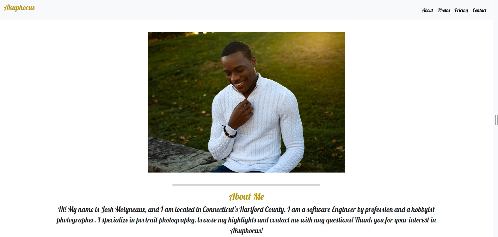
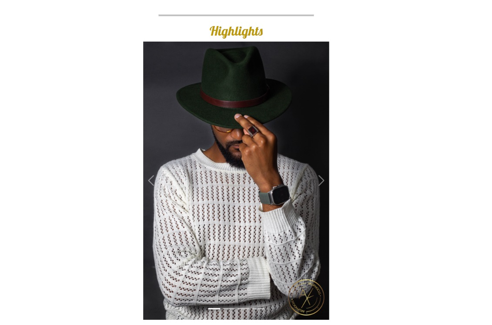
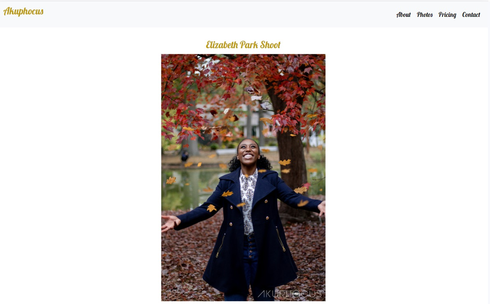
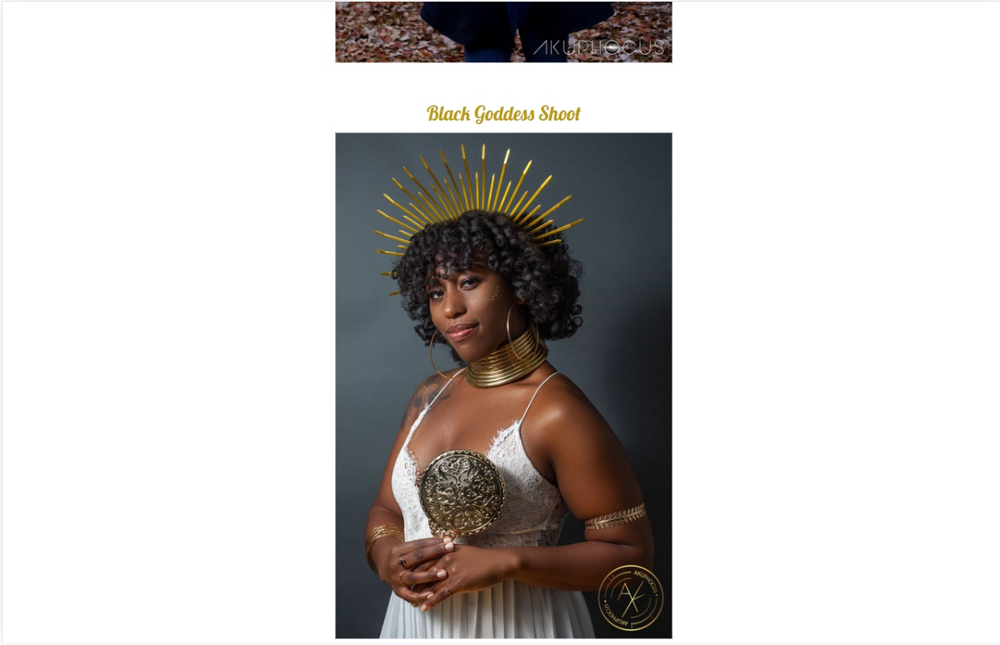
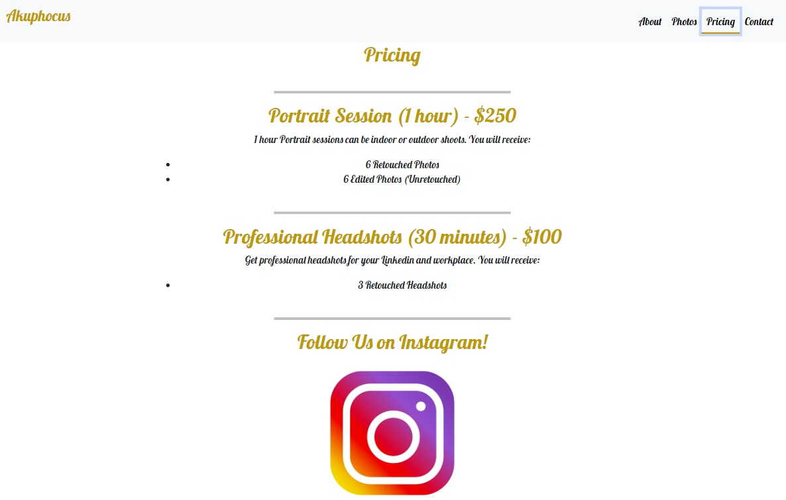
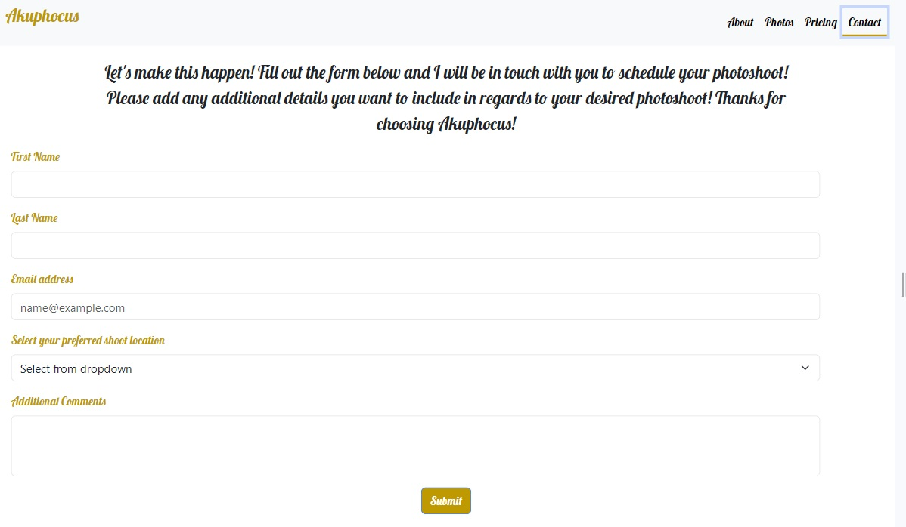

# Akuphocus Photography 

## Description

Created a website for Akuphocus Photography. Which is a social media page where I post my photos that I take as a hobby. This page would be how I would like my website to look if Akuphocus Photography was a business of mine. 

Published website:  https://akuphocusphotography-b451aa9076d6.herokuapp.com/

## Installation

N/A

## Usage

Use Akuphocus Photography's web page to take a look at Josh Molyneaux's work and contact him if you would like to book an appointment of your own! 

## Credits

N/A

## License

MIT License - Please refer to the LICENSE in the repo.

## Usage
The following image shows the home page of Akuphocus, which allows users to see an about me section and a slideshow of highlights:

The follwing image shows the Photos page of Akuphocus, here you can see some showcase photoshoots which link to an image sharing website with all images from the photoshoot:

The following image shows the Pricing page for Akuphocus: 

The following image shows the Contact page for Akuphocus, here you can submit a request form with information to be contacted: 

